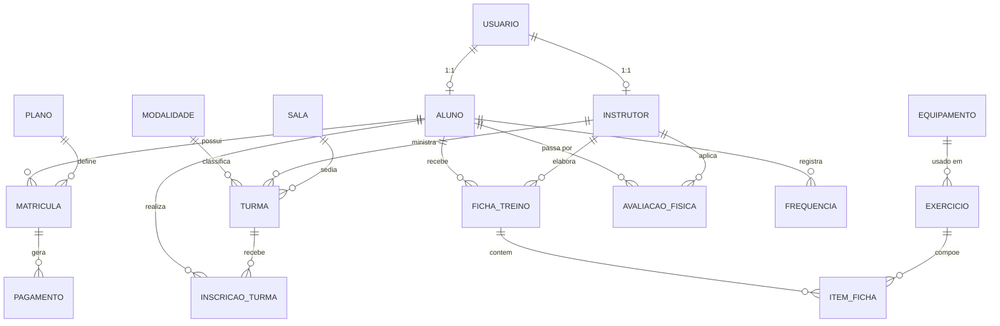

# Diagrama Entidade-Relacionamento

Veja direto no GitHub ou cole o bloco em https://mermaid.live para exportar a imagem.

```mermaid
erDiagram
    USUARIO ||--o| ALUNO : "1:1"
    USUARIO ||--o| INSTRUTOR : "1:1"
    ALUNO ||--o{ MATRICULA : possui
    PLANO ||--o{ MATRICULA : define
    MATRICULA ||--o{ PAGAMENTO : gera
    ALUNO ||--o{ INSCRICAO_TURMA : realiza
    TURMA ||--o{ INSCRICAO_TURMA : recebe
    MODALIDADE ||--o{ TURMA : classifica
    INSTRUTOR ||--o{ TURMA : ministra
    SALA ||--o{ TURMA : sedia
    EQUIPAMENTO ||--o{ EXERCICIO : "usado em"
    ALUNO ||--o{ FICHA_TREINO : recebe
    INSTRUTOR ||--o{ FICHA_TREINO : elabora
    FICHA_TREINO ||--o{ ITEM_FICHA : contem
    EXERCICIO ||--o{ ITEM_FICHA : compoe
    ALUNO ||--o{ AVALIACAO_FISICA : "passa por"
    INSTRUTOR ||--o{ AVALIACAO_FISICA : aplica
    ALUNO ||--o{ FREQUENCIA : registra
```
